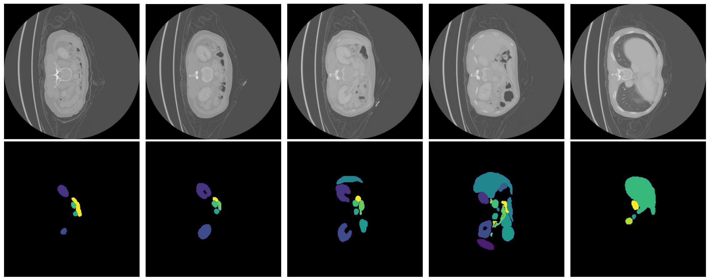

# MedicalDigitalHuman: Skin, Skeleton and Organ
This project is aimed to build a 3D digital twin of a human for medical use. Nowadays, 3D human model is mostly built in the standard template, while a personalized model is able to provide more accurate information and customized service for each patient. Therefore,
how to build a personalized model in an effective and efficient way is about to explore in this project.

## 3D Digital Human

## Abdominal Organ Segmentation

Dataset will be release soon !

## Acknowledgments
We thank [SKEL](https://github.com/MarilynKeller/SKEL) and [3DHumanHeart](https://github.com/simonreisinger/Interactive-3D-Human-Heart-Visualization) for their pioneering works.

## License
This project is licensed under MIT license.
