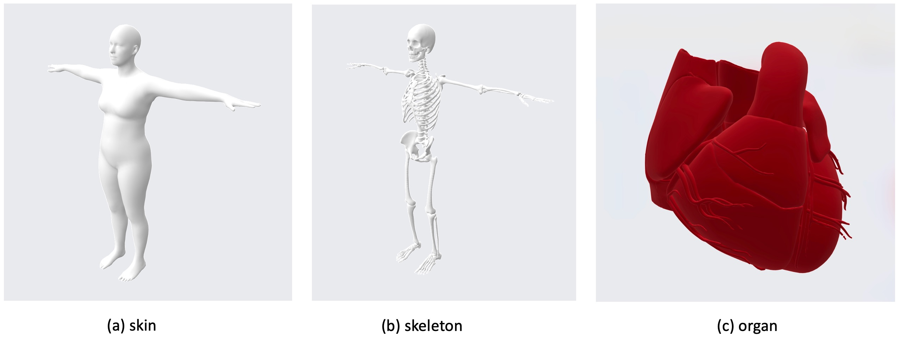

# MedicalDigitalHuman: Skin, Skeleton and Organ

## Acknowledgments
We thank [SKEL](https://github.com/MarilynKeller/SKEL) and [3DHumanHeart](https://github.com/simonreisinger/Interactive-3D-Human-Heart-Visualization) for their pioneering works.

## License
This project is licensed under MIT license.
